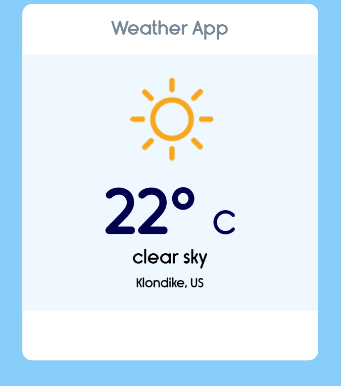

# Weather-App

- Basic weather app that shows temperature and description using the OpenWeatherMap API
- Displays current weather info in both Celsius and Fahrenheit based on the user's location

- This App was built using [OpenWeatherMap](https://openweathermap.org/) API.

# Demo

